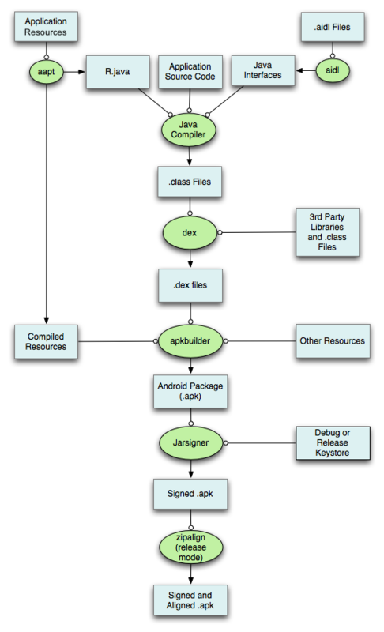

# Android编译过程



| 名称  | 功能  | 路径 |
|---|---|---|
| aapt  | Android资源打包工具 | ${ANDROID_SDK_HOME}/build-tools/appt |
| aidl  | Android接口描述语言转化为.java文件的工具 | ${ANDROID_SDK_HOME}/build-tools/aidl |
| javac  | Java Compiler | ${JDK_HOME}/javac或/usr/bin/javac |
| dex  | 转化.class文件为Davik VM能识别的.dex文件 | ${ANDROID_SDK_HOME}/build-tools/dx |
| apkbuilder  | 生成apk包 | ${ANDROID_SDK_HOME}/tools/apkbuilder |
| jarsigner  | .jar文件的签名工具 | ${JDK_HOME}/jarsigner或/usr/bin/jarsigner |
| zipalign  | 字节码对齐工具 | ${ANDROID_SDK_HOME}/build-tools/zipalign |

## aapt

> 全称：Android Asset Packaging Tool

进入应用程序目录,新建一个gen目录,没有gen目录,命令将会出现找不到文件的错误!

命令成功执行后将会在gen目录下生成成包结构的目录树,及R.java文件!

### 用法

#### 1.列出压缩文件(zip,jar,apk)中的目录内容

    aapt l[ist] [-v] [-a] file.{zip,jar,apk}

`-v`：详细信息

`-a`：非常详细的信息

结果说明：

- Method:压缩方法，Deflate及Stored两种，即该Zip目录采用的算法是压缩模式还是存储模式；可以看出resources.arsc、*.png采用压缩模式，而其它采用压缩模式。
- Ratio:压缩率

举例：

```bash
λ aapt.exe l DybDemo.apk
AndroidManifest.xml
assets/developer_config.properties
res/drawable-hdpi-v4/choose_dialog.9.png
res/drawable-hdpi-v4/ic_launcher.png
res/drawable-hdpi-v4/qq_btn.png
res/drawable-hdpi-v4/weixin_btn.png
res/drawable-hdpi-v4/yyb_qq.png
res/drawable-hdpi-v4/yyb_weixin.png
res/drawable-mdpi-v4/ic_launcher.png
res/drawable-mdpi-v4/ic_launcher_1.png
res/drawable-xhdpi-v4/ic_launcher.png
res/drawable-xhdpi-v4/ic_launcher_1.png
res/drawable-xxhdpi-v4/ic_launcher.png
res/drawable-xxhdpi-v4/ic_launcher_1.png
res/drawable/bdp_bg_white_round_border.xml
res/drawable/bdp_bg_white_round_qq.xml
res/drawable/bdp_bg_white_round_wx.xml
res/layout/activity_main.xml
resources.arsc
classes.dex
```

#### 2.通过参数配置可以dump apk中各种详细信息

    aapt d[ump] [--values] [--include-meta-data] WHAT file.{apk} [asset [asset ...]]

说明：

```
 strings          Print the contents of the resource table string pool in the APK.
 badging          Print the label and icon for the app declared in APK.
 permissions      Print the permissions from the APK.
 resources        Print the resource table from the APK.
 configurations   Print the configurations in the APK.
 xmltree          Print the compiled xmls in the given assets.
 xmlstrings       Print the strings of the given compiled xml assets.
```

举例：

有用一点的APK信息就可以用`badging`参数获取，比如包名、versionCode、versionName、targetSdkVersion等等

```
λ aapt.exe d badging DybDemo.apk
package: name='com.example.dybdemo' versionCode='1' versionName='1.0'
uses-permission: name='android.permission.INTERNET'
uses-permission: name='android.permission.ACCESS_NETWORK_STATE'
uses-permission: name='android.permission.ACCESS_WIFI_STATE'
uses-permission: name='android.permission.READ_PHONE_STATE'
sdkVersion:'14'
targetSdkVersion:'21'
application-label:'DybDemo'
application-icon-160:'res/drawable-mdpi-v4/ic_launcher.png'
application-icon-240:'res/drawable-hdpi-v4/ic_launcher.png'
application-icon-320:'res/drawable-xhdpi-v4/ic_launcher.png'
application-icon-480:'res/drawable-xxhdpi-v4/ic_launcher.png'
application: label='DybDemo' icon='res/drawable-mdpi-v4/ic_launcher.png'
launchable-activity: name='com.example.dybdemo.MainActivity'  label='DybDemo' icon=''
feature-group: label=''
  uses-feature: name='android.hardware.faketouch'
  uses-implied-feature: name='android.hardware.faketouch' reason='default feature for all apps'
  uses-feature: name='android.hardware.wifi'
  uses-implied-feature: name='android.hardware.wifi' reason='requested android.permission.ACCESS_WIFI_STATE permission'
main
supports-screens: 'small' 'normal' 'large' 'xlarge'
supports-any-density: 'true'
locales: '--_--'
densities: '160' '240' '320' '480'
```

#### 3.编译资源打包资源文件

```
aapt p[ackage] [-d][-f][-m][-u][-v][-x][-z][-M AndroidManifest.xml] \
        [-0 extension [-0 extension ...]] [-g tolerance] [-j jarfile] \
        [--debug-mode] [--min-sdk-version VAL] [--target-sdk-version VAL] \
        [--app-version VAL] [--app-version-name TEXT] [--custom-package VAL] \
        [--rename-manifest-package PACKAGE] \
        [--rename-instrumentation-target-package PACKAGE] \
        [--utf16] [--auto-add-overlay] \
        [--max-res-version VAL] \
        [-I base-package [-I base-package ...]] \
        [-A asset-source-dir]  [-G class-list-file] [-P public-definitions-file] \
        [-D main-dex-class-list-file] \
        [-S resource-sources [-S resource-sources ...]] \
        [-F apk-file] [-J R-file-dir] \
        [--product product1,product2,...] \
        [-c CONFIGS] [--preferred-density DENSITY] \
        [--split CONFIGS [--split CONFIGS]] \
        [--feature-of package [--feature-after package]] \
        [raw-files-dir [raw-files-dir] ...] \
        [--output-text-symbols DIR]
```

说明：

```
-d:包括一个或多个设备资源,由逗号分隔;
-f:覆盖现有的文件命令,加上后编译生成直接覆盖目前已经存在的R.java;
-m:使生成的包的目录放在-J参数指定的目录;
-u:更新现有的包 u = update;
-v:详细输出,加上此命令会在控制台输出每一个资源文件信息,R.java生成后还有注释。
-x:创建扩展资源ID;
-z:需要本地化的资源属性标记定位。
-M:AndroidManifest.xml的路径
-0:指定一个额外的扩展. apk文件将不会存储压缩
-g:制定像素迫使图形的灰度
-j:指定包含一个jar或zip文件包,这个命令很特别
–debug-mode:指定的是调试模式下的编译资源;
–min-sdk-versopm VAL:最小SDK版本 如是7以上 则默认编译资源的格式是 utf-8
–target-sdk-version VAL:在androidMainfest中的目标编译SDK版本
–app-version VAL:应用程序版本号
–app-version-name TEXT:应该程序版本名字;
–custom-package VAL:生成R.java到一个不同的包
–rename-mainifest-package PACKAGE:修改APK包名的选项;
–rename-instrumentation-target-package PACKAGE:重写指定包名的选项;
–utf16:资源编码修改为更改默认utf – 16编码;
–auto-add-overlay:自动添加资源覆盖
–max-res-version:最大资源版本
-I:指定的SDK版本中android.jar的路径
-A:assert文件夹的路径
-G:一个文件输出混淆器选项,后面加文件逗号隔开.
-P:指定的输出公共资源,可以指定一个文件 让资源ID输出到那上面;
-S:指定资源目录 一般是 res
-F:指定把资源输出到 apk文件中
-J:指定R.java输出的路径
raw-file-dir:附加打包进APK的文件
```

举例：

    aapt package -f -S AAPTDemo/app/src/main/res -I Android/sdk/platforms/android-25/android.jar -A AAPTDemo/app/src/main/assets -M AAPTDemo/app/src/main/AndroidManifest.xml -F AAPTDemo/app/out.apk

#### 4.在一个zip包中添加一个一个指定的文件

    aapt a[dd] [-v] file.{zip,jar,apk} file1 [file2 ...]

说明：可以不反编译apk文件直接修改然后签名,比如修改包的MD5值

#### 5.从一个zip archive文件中删除一个文件

    aapt r[emove] [-v] file.{zip,jar,apk} file1 [file2 ...]

> 还有其他不常用的功能，参考aapt的说明

## aidl

处理AIDL文件，生成对应的.java文件

### 用法

```
-I<DIR>    search path for import statements.  
-d<FILE>   generate dependency file.  
-p<FILE>   file created by –preprocess to import.  
-o<FOLDER> base output folder for generated files.  
-b         fail when trying to compile a parcelable.  
```

值得注意的是：这个工具的参数与参数值之间不能有空格!

## javac

编译Java文件，生成对应的.class文件

### 用法

```
javac <options> <source files>
-g                         生成所有调试信息  
-g:none                    不生成任何调试信息  
-g:{lines,vars,source}     只生成某些调试信息  
-nowarn                    不生成任何警告  
-verbose                   输出有关编译器正在执行的操作的消息  
-deprecation               输出使用已过时的 API 的源位置  
-classpath <路径>            指定查找用户类文件和注释处理程序的位置  
-cp <路径>                   指定查找用户类文件和注释处理程序的位置  
-sourcepath <路径>           指定查找输入源文件的位置  
-bootclasspath <路径>        覆盖引导类文件的位置  
-extdirs <目录>              覆盖安装的扩展目录的位置  
-endorseddirs <目录>         覆盖签名的标准路径的位置  
-proc:{none,only}          控制是否执行注释处理和/或编译。  
-processor <class1>[,<class2>,<class3>…]要运行的注释处理程序的名称；绕过默认的搜索进程  
-processorpath <路径>        指定查找注释处理程序的位置  
-d <目录>                    指定存放生成的类文件的位置  
-s <目录>                    指定存放生成的源文件的位置  
-implicit:{none,class}     指定是否为隐式引用文件生成类文件  
-encoding <编码>             指定源文件使用的字符编码  
-source <版本>               提供与指定版本的源兼容性  
-target <版本>               生成特定 VM 版本的类文件  
-version                   版本信息  
-help                      输出标准选项的提要  
-Akey[=value]              传递给注释处理程序的选项  
-X                         输出非标准选项的提要  
-J<标志>                     直接将 <标志> 传递给运行时系统  
```

举例：

    javac -encoding utf-8 -target 1.5 -bootclasspath android.jar -d bin src\com\byread\reader\*.java gen\com\byread\reader\R.java 

## dex

把.class文件转化成Davik VM支持的.dex文件

### 用法

```
dx --dex [--debug] [--verbose] [--positions=<style>] [--no-locals]
  [--no-optimize] [--statistics] [--[no-]optimize-list=<file>] [--no-strict]
  [--keep-classes] [--output=<file>] [--dump-to=<file>] [--dump-width=<n>]
  [--dump-method=<name>[*]] [--verbose-dump] [--no-files] [--core-library]
  [--num-threads=<n>] [--incremental] [--force-jumbo] [--no-warning]
  [--multi-dex [--main-dex-list=<file> [--minimal-main-dex]]
  [--input-list=<file>] [--min-sdk-version=<n>]
  [--allow-all-interface-method-invokes]
  [<file>.class | <file>.{zip,jar,apk} | <directory>] ...
```

举例：

```
dx --dex --output=<要生成的classes.dex路径> <要处理的类文件的路径>
dx --dex --output=D:/HelloWorld/bin/classes.dex D:/HelloWorld/bin
```

## apkbuilder

打包后的资源文件、打包后类文件（.dex文件）、libs文件（包括.so文件，当然很多工程都没有这样的文件，如果你不使用C/C++开发的话）

> 貌似现在不用这个了

### 用法

    apkbuilder  output.apk.file−u−z{packagedresource.file} -f  dex.file−rf{source.dir}  -rj  ${libraries.dir} 

## jarsigner

对未签名.apk文件进行签名

### 用法

```
jarsigner [选项] jar-file 别名
jarsigner -verify [选项] jar-file [别名...]

[-keystore <url>]           密钥库位置
[-storepass <口令>]         用于密钥库完整性的口令
[-storetype <类型>]         密钥库类型
[-keypass <口令>]           私有密钥的口令 (如果不同)
[-certchain <文件>]         替代证书链文件的名称
[-sigfile <文件>]           .SF/.DSA 文件的名称
[-signedjar <文件>]         已签名的 JAR 文件的名称
[-digestalg <算法>]        摘要算法的名称
[-sigalg <算法>]           签名算法的名称
[-verify]                   验证已签名的 JAR 文件
[-verbose[:suboptions]]     签名/验证时输出详细信息。
                            子选项可以是 all, grouped 或 summary
[-certs]                    输出详细信息和验证时显示证书
[-tsa <url>]                时间戳颁发机构的位置
[-tsacert <别名>]           时间戳颁发机构的公共密钥证书
[-tsapolicyid <oid>]        时间戳颁发机构的 TSAPolicyID
[-tsadigestalg <算法>]      时间戳请求中的摘要数据的算法
[-altsigner <类>]           替代的签名机制的类名
[-altsignerpath <路径列表>] 替代的签名机制的位置
[-internalsf]               在签名块内包含 .SF 文件
[-sectionsonly]             不计算整个清单的散列
[-protected]                密钥库具有受保护验证路径
[-providerName <名称>]      提供方名称
[-providerClass <类>        加密服务提供方的名称
[-providerArg <参数>]]... 主类文件和构造器参数
[-strict]                   将警告视为错误
```

举例：

    jarsigner -keystore debug.keystore -digestalg SHA1 -sigalg SHA1withRSA MyApp.apk androiddebugkey

## zipalign

对签名后的.apk文件进行对齐处理（不进行对齐处理是不能发布到Google Market的）

### 用法

```
zipalign [-f] [-p] [-v] [-z] <align> infile.zip outfile.zip
zipalign -c [-p] [-v] <align> infile.zip

<align>: alignment in bytes, e.g. '4' provides 32-bit alignment
-c: check alignment only (does not modify file)
-f: overwrite existing outfile.zip
-p: memory page alignment for stored shared object files
-v: verbose output
-z: recompress using Zopfli
```

举例：

    zipalign -v 4 source.apk destination.apk


## 关于APK签名

从Android 7.0开始, 谷歌增加新签名方案 V2 Scheme (APK Signature);
但Android 7.0以下版本, 只能用旧签名方案 V1 scheme (JAR signing)

**V1签名**

来自JDK(jarsigner), 对zip压缩包的每个文件进行验证, 签名后还能对压缩包修改(移动/重新压缩文件)

对V1签名的apk/jar解压,在META-INF存放签名文件(MANIFEST.MF, CERT.SF, CERT.RSA), 
其中MANIFEST.MF文件保存所有文件的SHA1指纹(除了META-INF文件), 由此可知: V1签名是对压缩包中单个文件签名验证


**V2签名**


来自Google(apksigner), 对zip压缩包的整个文件验证, 签名后不能修改压缩包(包括zipalign),
对V2签名的apk解压,没有发现签名文件,重新压缩后V2签名就失效, 由此可知: V2签名是对整个APK签名验证

V2签名优点很明显:

签名更安全(不能修改压缩包)
签名验证时间更短(不需要解压验证),因而安装速度加快

注意: apksigner工具默认同时使用V1和V2签名,以兼容Android 7.0以下版本