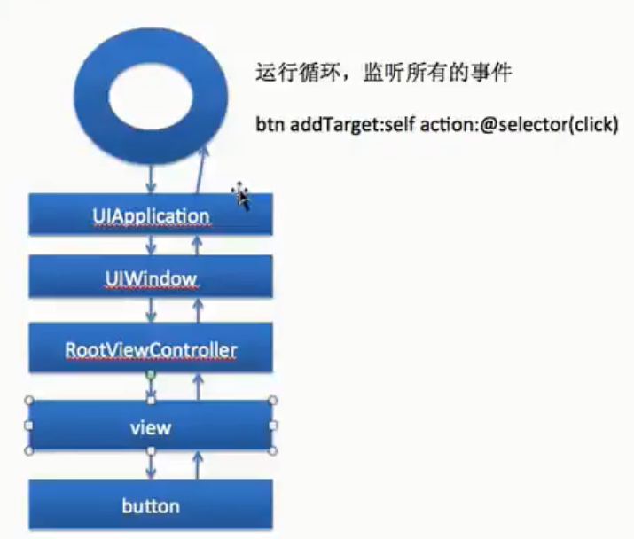

# 触摸事件

继承了UIResponder的类都有触摸事件，比如UIViewController，自定义View等。

```objc
// touches 有几个元素就表示有几个手指同时操作
- (void)touchesBegan:(NSSet<UITouch *> *)touches withEvent:(UIEvent *)event {
    // 按下
    UITouch * t = [touches anyObject];
    CGPoint point = [t locationInView:self.superview];
    // 点击的坐标
    NSLog(@"x=%f,y=%f", point.x, point.y);
}

// 移动
- (void)touchesMoved:(NSSet<UITouch *> *)touches withEvent:(UIEvent *)event {
    // 随手指移动
    UITouch * t = [touches anyObject];
    // 当前位置
    CGPoint p = [t locationInView:self.superview];
    // 上一个点的位置
    CGPoint lastP = [t previousLocationInView:self.superview];
    // 偏移量
    CGFloat offsetX = p.x - lastP.x;
    CGFloat offestY = p.y - lastP.y;
    self.center = CGPointMake(self.center.x + offsetX, self.center.y + offestY);
}

- (void)touchesEnded:(NSSet<UITouch *> *)touches withEvent:(UIEvent *)event {
    // 抬起
}

- (void)touchesCancelled:(NSSet<UITouch *> *)touches withEvent:(UIEvent *)event {
    // 滑动被中断，比如来电话
}
```

## 事件传递

从上层向下层传递，和Android类似。



## 手势解锁(九宫格)

